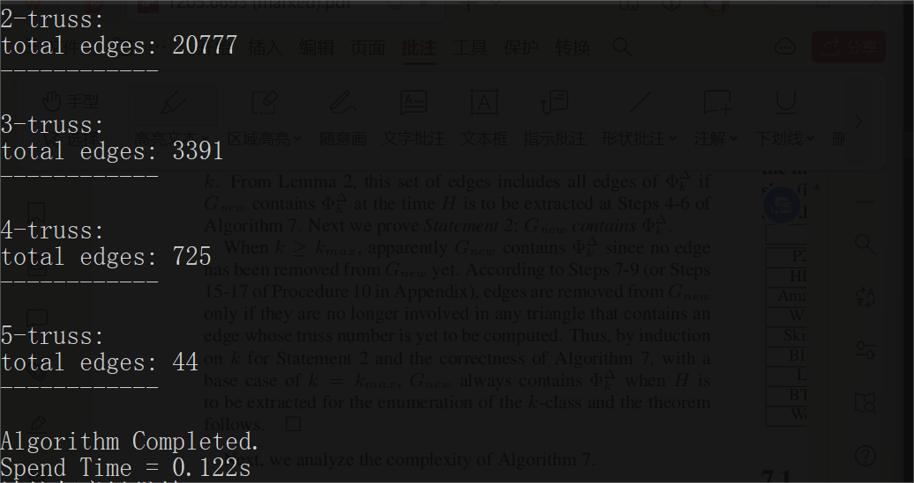
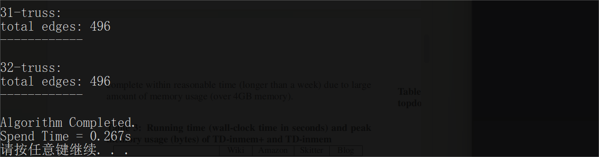
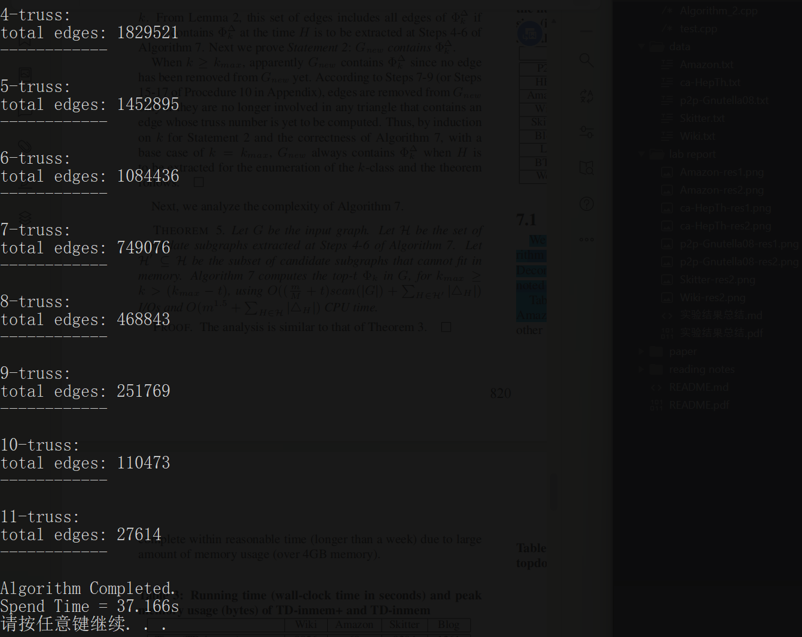
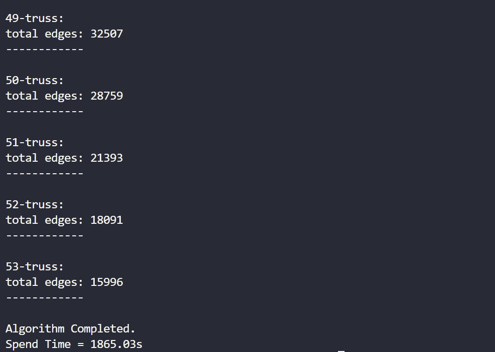
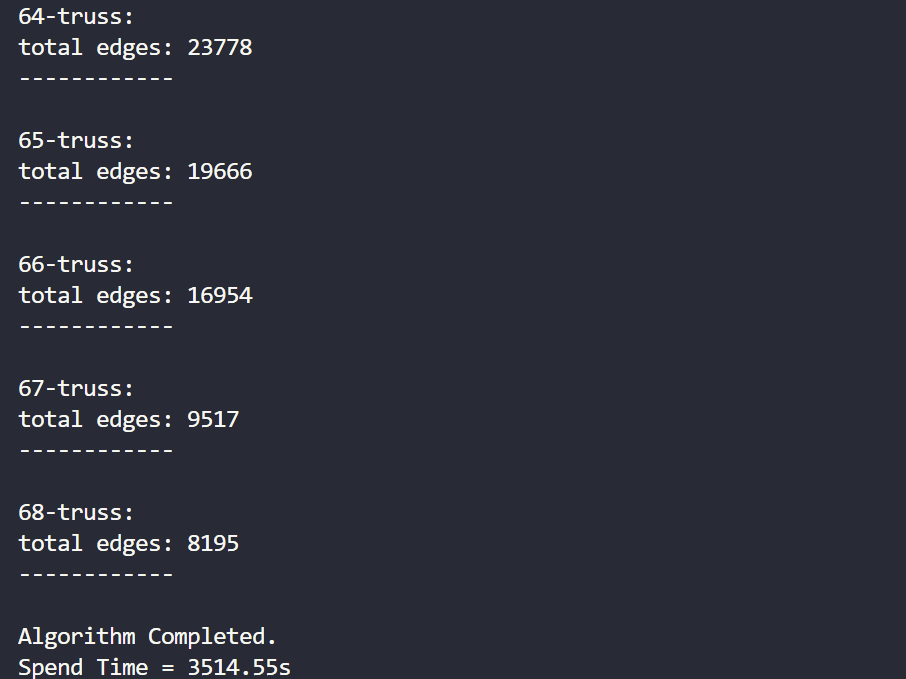
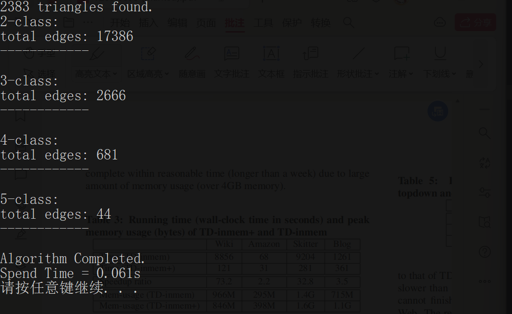
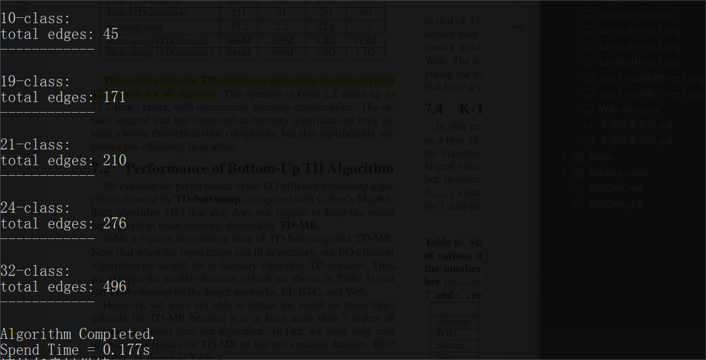
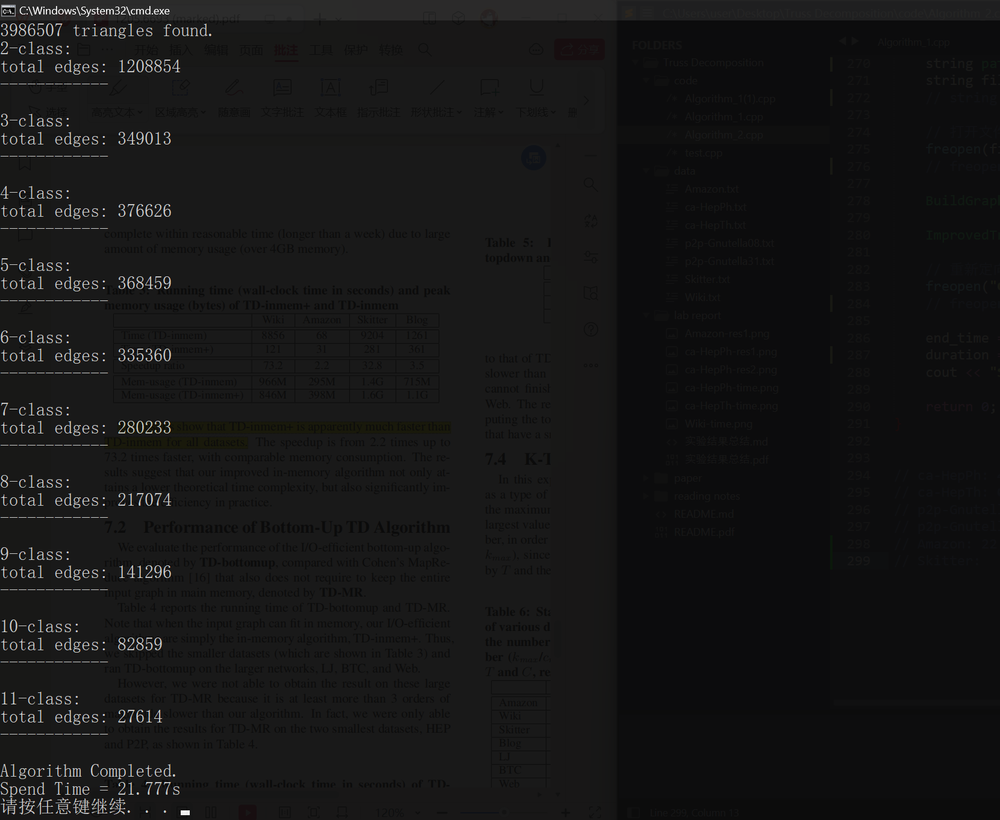
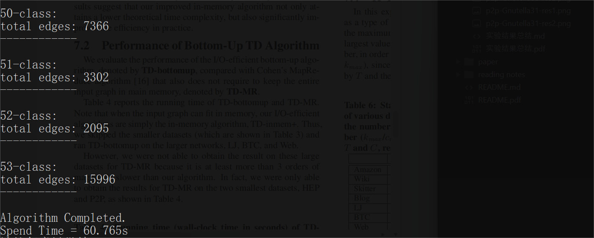
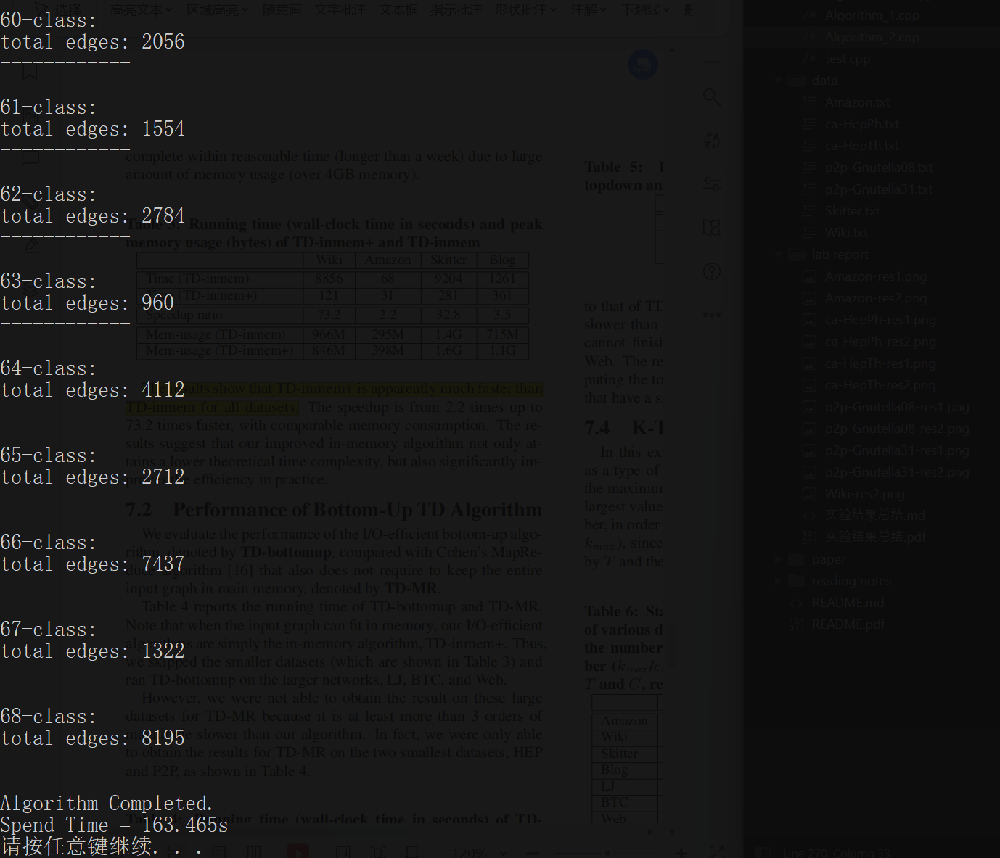

<h1 align='center'>
    实验结果总结
</h1>

## $\text{Algorithm 1}$

### **P2P 数据集**

- **运行结果**

    $k_{max} = 5$，每个 $k\text{-truss}$ 包含的边数如图。

- **运行时间**

    运行时间在 0.122s 左右。

    

        
    
 

 

### **HEP 数据集**

- **运行结果**

    $k_{max} = 32$，每个 $k\text{-truss}$ 包含的边数如图（部分截图）。

- **运行时间**

    运行时间在 0.267s 左右。

    

        
    
 

### **Amazon 数据集**

- **运行结果**

    $k_{max} = 11$，每个 $k\text{-truss}$ 包含的边数如图。

- **运行时间**

    运行时间在 37.166s 左右。

    

        
    
 

 

### **Wiki 数据集**

- **运行结果**

    $k_{max} = 53$，每个 $k\text{-truss}$ 包含的边数如图。

- **运行时间**

    运行时间在 1865.03s 左右。

    

        
    
 

 

### **Skitter 数据集**

- **运行结果**

    $k_{max} = 68$，每个 $k\text{-truss}$ 包含的边数如图。

- **运行时间**

    运行时间在 3514.55s 左右。

    

        
    
 

## $\text{Algorithm 2}$

### **P2P 数据集**

- **运行结果**

    $k_{max} = 5$，每个 $k\text{-class}$ 包含的边数如图。

- **运行时间**

    运行时间在 **0.061s** 左右。运行时间是算法 1 的将近一半。

    

        
    
 

 

### **HEP 数据集**

- **运行结果**

    $k_{max} = 32$，每个 $k\text{-class}$ 包含的边数如图（部分截图）。

- **运行时间**

    运行时间在 **0.177s** 左右。运行时间优于算法 1。

    

        
    
 

 

### **Amazon 数据集**

- **运行结果**

    $k_{max} = 11$，每个 $k\text{-class}$ 包含的边数如图。

- **运行时间**

    运行时间在 **21.777s** 左右。运行时间明显优于算法 1。

    

        
    
 

 

### **Wiki 数据集**

- **运行结果**

    $k_{max} = 53$，每个 $k\text{-class}$ 包含的边数如图。

- **运行时间**

    运行时间在 **60.765s** 左右。

    

        
    
 

 

### **Skitter 数据集**

- **运行结果**

    $k_{max} = 68$，每个 $k\text{-class}$ 包含的边数如图。

- **运行时间**

    运行时间在 **163.465s** 左右。

    

        
    
 

## **数据集信息**

| Name | $V_G$  | $E_G$ | Number of $\bigtriangleup$ | $k_{max}$ |
|:--------|:---------:|:--------:|:--------:|:--------:|
| [P2P](https://snap.stanford.edu/data/p2p-Gnutella08.html) | 6,301 | 41,554 | 2383 | 5 |
| [HEP](https://snap.stanford.edu/data/ca-HepTh.html) | 9,877 | 25,998 | 28339 | 32 |
| [Amazon](https://snap.stanford.edu/data/amazon0601.html) | 403,394 | 3,387,388 | 3,986,507 | 11 | 
| [Wiki](https://snap.stanford.edu/data/wiki-Talk.html) | 2,394,385 | 5,021,410 | 9,203,519 | 53 | 
| [Skitter](https://snap.stanford.edu/data/as-Skitter.html) | 1,696,415 | 11,095,298 | 28,769,868 | 68 | 

 

## **运行时间对比**

| Name | Algorithm 1  | Algorithm 2 |
|:--------|:---------:|:--------:|
| [P2P](https://snap.stanford.edu/data/p2p-Gnutella08.html)  | 0.122s | **0.061s** |
| [HEP](https://snap.stanford.edu/data/ca-HepTh.html) | 0.267s | **0.177s** |
| [Amazon](https://snap.stanford.edu/data/amazon0601.html) | 37.166s | **21.777s** |
| [Wiki](https://snap.stanford.edu/data/wiki-Talk.html) | 1865.03s | **60.765s** |
| [Skitter](https://snap.stanford.edu/data/as-Skitter.html) | 3514.55s | **163.465s** |

 

## **总结**

$\text{Algorithm 1}$ 和 $\text{Algorithm 2}$ 实现的代码大部分是自己实现的，部分函数功能的实现（如 bin sort、triangle listing 等）参考了引用文献以及 Github 上相关的项目 [truss-decomposition](https://github.com/cntswj/truss-decomposition/tree/master)。

在运行结果方面，两种算法 $k_{max}$ 结果一致，且对应的 $k\text{-truss}$ 的边数、$k\text{-class}$ 的边数也都互相一致。与 Github 上的项目代码进行对拍后，可以验证输出的 $k\text{-truss}$ / $k\text{-class}$ 结果是正确的。

在运行时间方面，$\text{Algorithm 2}$ 运行所需时间优于 $\text{Algorithm 1}$，尤其是在较大的数据集 [Amazon](https://snap.stanford.edu/data/amazon0601.html) 上。 

但是，在本机上的运行时间都要明显快于论文中的运行时间。个人猜测可能与电脑算力、实现部分算法所用的数据结构、GCC 版本等因素有关。